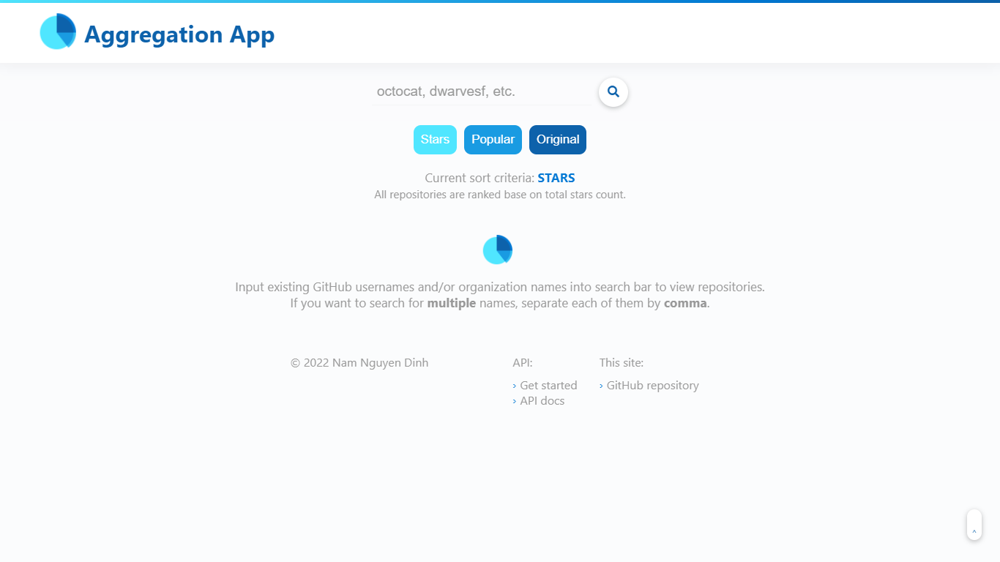
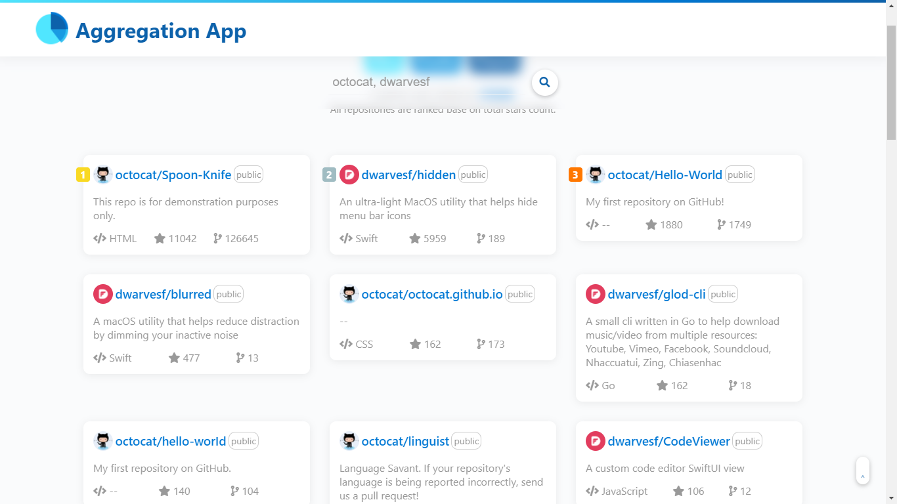

<div align="center"></div>

# [Aggregation App](https://aggregationapp.netlify.app/)

`JavaScript` `React` `Frontend`

Simple Aggregation App using GitHub APIs.

## Problem Statement

We want to list all public GitHub repos based on usernames and org names. 

For instance, `dwarvesf` is an org name and `gaearon` is a username.

Create a `React` app that has the following features:

- A search bar that supports user input for **multiple** GitHub usernames, orgs
- Create sort options that support these criteria:
    - Most stars
    - Most popular - with popularity based on `stars`, `watchers`, and `forks`
    - Most popular original works (unforked repositories)

## Structure
```
App
  |
  |__ Home page
              |__ Search bar (users and/or organizations name)
              |
              |__ Sort criteria
              |
              |__ Repo list
                          |__ Repos
```

## Views Flow

```
Home Page 
-> Input Name(s)   -> Repo List     -> Select Criterion -> (Updated) Repo List
-> Select Criterion -> Input Name(s) -> Repo List
```

## Practices

- Hook (update state of sort criterion)
- Lifecycle (rerender component on props of names or sort criterion changes)
- Promise chaining
- Handle multiple inputs as usernames and/or organization names
- Fetch [GitHub Rest API](https://docs.github.com/en/rest/guides/getting-started-with-the-rest-api) endpoints for `users` and `orgs`
- `Set` data structure and sort algorithm
- Style with CSS (no Bootstrap or any UI/UX framework or library)

## Website URL and QR Code

- **URL**: [https://aggregationapp.netlify.app/](https://aggregationapp.netlify.app/)

- **QR Code**:
<div align="center"></div>

## Preview

<div align="center"> </div>
